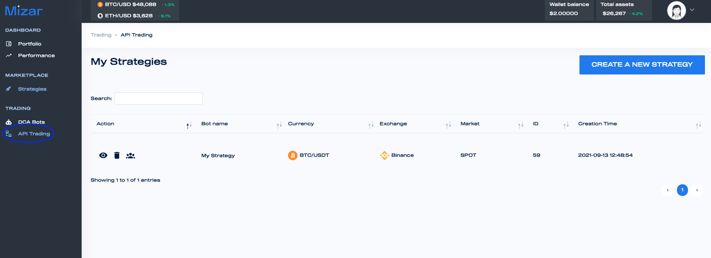
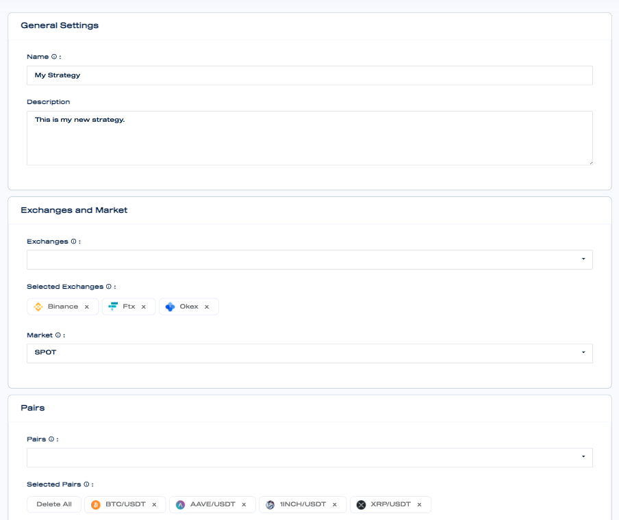
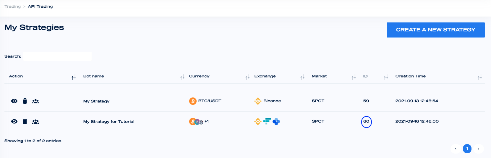

# Create strategy

Go to the API trading section and click on create a new strategy

Set up your strategy chosing name, description, exchange, pairs and market. The strategy can be set on different exchanges and at least or pair.

Create a new strategy. The ID of the strategy will be the key to be used in the API trading.

