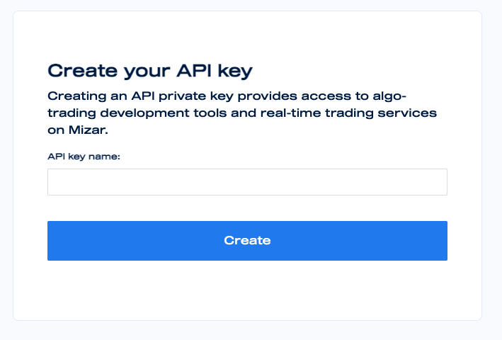

# How to create API key

#### Creating your own Mizar API

* After logging into Mizar, click API situated at the top right dropdown.

* Give a name to the API key and click create. 

* The API key will be shown at the bottom of the page
* Use the API key in your strategy development environment and remember to don't share your API key with anyone

