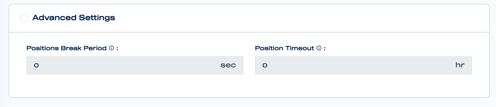

# Advanced Settings

In the advanced settings section you can add powerful parameters to your bot to open or close a position based on special conditions.

#### **Position Break Period**

The Position Break Period indicates the time to be waited before opening a new position after a position is closed.

#### Position Timeout

The Position Timeout indicates the period after which an open position will be closed. 

