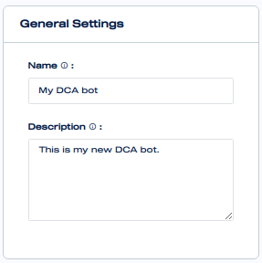
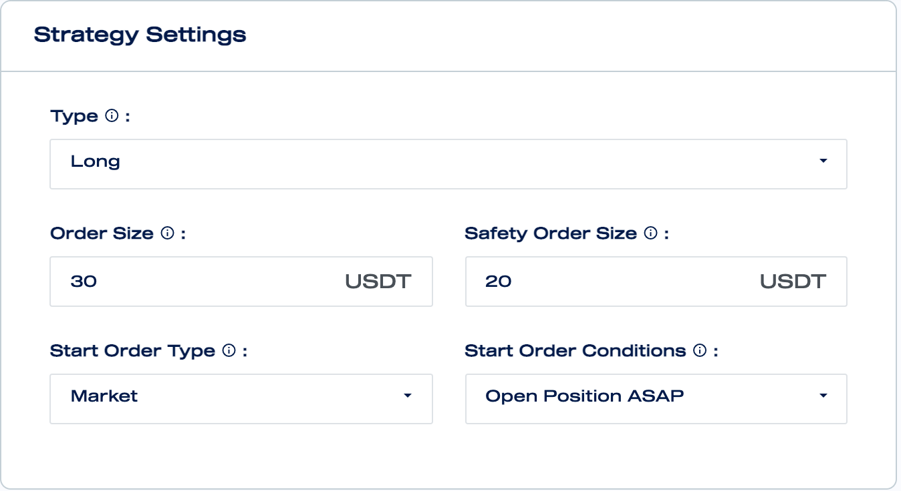
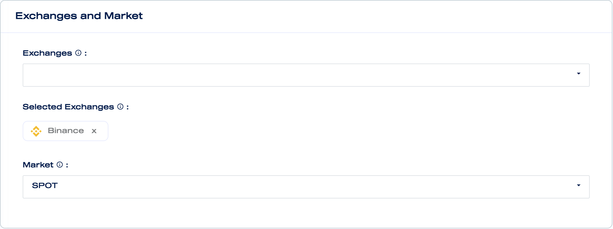

# Create a New DCA Bot

Go to the DCA bots [page](https://mizar.ai/dashboard/trading/dca-bot) and click on the 'Create new bot' button.

### General Settings

In the general settings you can enter a name for your bot and provide a description for your bot. The name and the description will be shared with other users, if the bot is made public.

### Strategy Settings

In the strategy Settings section, you can set the high-level behaviors of your bot.

#### Type

The bot can be of two different types: long or short. A Long bot takes long positions which means that it buys and then sells in order to generate profits. Instead, a short bot is a bot that sells and then buys in order to generate profits.

#### Order Size

Order Size indicates the size of the start order of the position. It is always defined in quote asset.

#### Safety Order Size

Safety Order Size is the size of the orders that get executed when the price goes against the position taken \(e.g. the position is long and the price goes down\). The Safety Orders are useful to reduce risks and generate profits with small price movements.

#### Start Order Type

There are two types of start order: Market and Limit. When Market type is selected the start order will be executed as market order. Instead when Limit type is selected the start order will be executed with a special aggressive limit order strategy that will avoid price slippage.

#### Start Order Conditions

Start order conditions define the conditions to open a new position.

* **Open Position ASAP:** open a new position as soon as possible
* **API**: open a new position through API command
* **TradingView \(webhook/API\)**: open a new position through TradingView custom signal
* **TradingView Indicators**: open a new position based on technical indicators settings customisable directly in MIzar

### Exchanges and Market

Exchanges and Market section define where your bot will trade.

Multiple exchanges can be assigned to a bot settings. Only when the bot is activated then you will be asked to decide in which exchange to run your dca bot.

Each bot setting can be assigned either to SPOT or FUTURES market.

