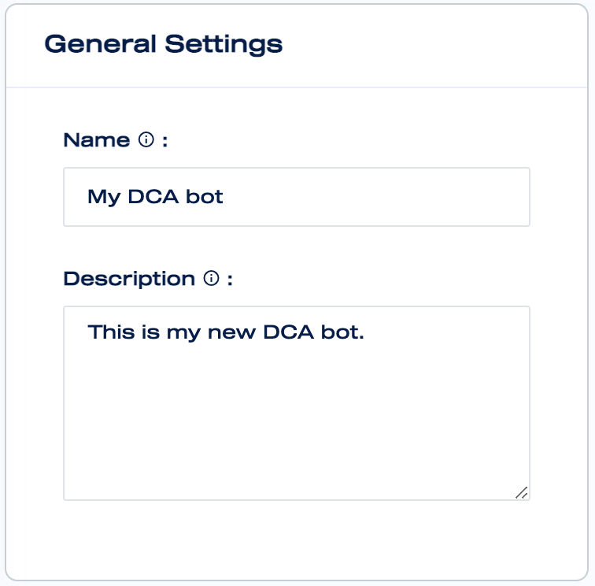
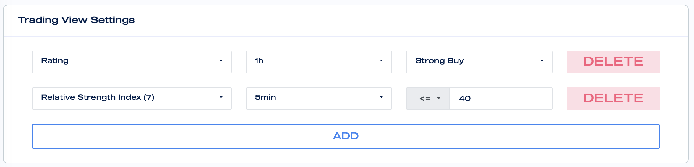
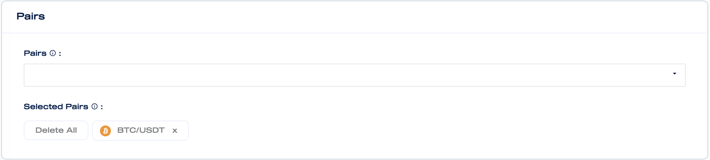
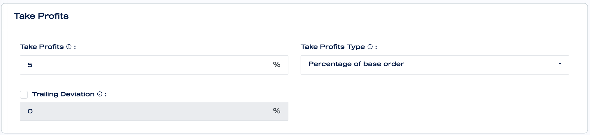
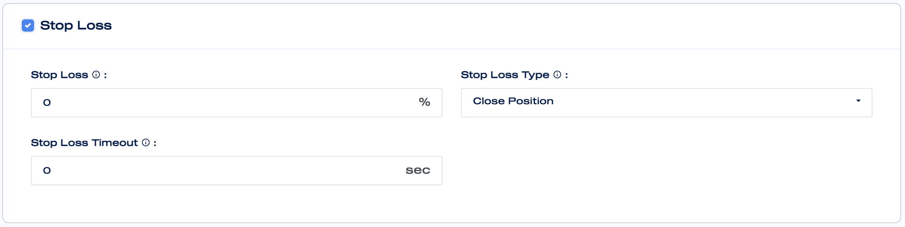
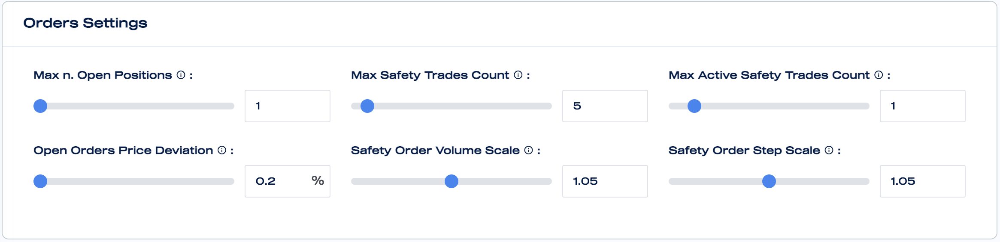
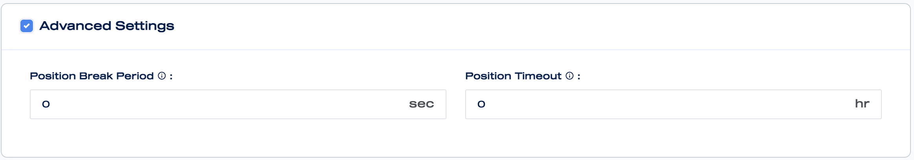

# Create a New DCA Bot

Go to the DCA bots [page](https://mizar.ai/dashboard/trading/dca-bot) and click on the 'Create new bot' button.

### General Settings

In the general settings you can enter a **name** for your bot and provide a **description** for your bot.


The name and the description will be shared with other users, if the bot is made public.


### Strategy Settings

In the strategy Settings section, you can set the high-level behaviours of your bot.

#### Type

The bot can be of two different types: long or short. A Long bot takes long positions which means that it buys and then sells in order to generate profits. Instead, a short bot is a bot that sells and then buys in order to generate profits.


Bots can only go short if the bot is trading in the futures market. If the bot is trading in the spot market it can only go long.


#### Order Size

Order Size indicates the size of the start order of the position. It is always defined in quote asset. For example, if the bot is trading BTC/USDT the size is expressed in USDT.

#### Safety Order Size

Safety Order Size is the size of the orders that get executed when the price goes against the position taken \(e.g. the position is long and the price goes down\).

#### Start Order Type

There are two types of start order: Market and Limit. When Market type is selected the start order will be executed as market order. Instead when Limit type is selected the start order will be executed with a special aggressive limit order strategy that will avoid price slippage.

#### Start Order Conditions

Start order conditions define the conditions to open a new position.

* **Open Position ASAP:** open a new position as soon as possible.
* **API**: open a new position through an API command.
* **TradingView \(webhook/API\)**: open a new position through TradingView's custom signal.
* **TradingView Indicators**: open a new position based on technical indicators from TradingView, which can be customised directly in Mizar. For example, it is possible to create a starting condition on a technical indicator, such that it only opens a position if the technical indicator's value is below or above some user set threshold. 

### Exchanges and Market

Exchanges and Market section define where your bot will trade.

Multiple exchanges can be assigned to a bot settings. Only when the bot is activated, then you will be asked to decide in which exchange to run your DCA bot.

Each bot setting can be assigned either to SPOT or FUTURES market.

### Pairs

In the pairs section you can select which pairs to trade. You have to select at least one pairs to trade with and you can select as many pairs as you want.

### Take Profits

In the take profits section, you can set the the take profit conditions.

* **Take Profits:** The percentage a which profit will be taken \(e.g. 1%\).
* **Take Profits Type:** There are two take profits type: either as percentage of the base order or as percentage of total volumes. If you select as **percentage of the base order**, then the take profit percentage will only be applied on the initial base order. For example if the base order size is 100 USD and the take profit percentage is 5%, then the bot will take profit when 5 USD profits can be realised. If multiple safety orders are hit in the same position, then the take profit order is recalculated in such a way that when it hits 5 USD profits will be made. If you select as **percentage of total volumes**, then the take profit percentage is applied on the total size of your position, i.e. base order including all hit safety orders.
* **Trailing Take Profit / Trailing Deviation \(Optional\):** _****_Optionally, it is also possible to activate trailing take profits. In this case when the take profit target has been hit, the position will not be closed immediately. The bot will track the position with a deviation percentage, for example, when the take profit percentage is 5% and the trailing deviation is 0.5%, then the bot trails the position at 4.5% profits. If the profits keep increasing, then the trailing profit target increases as well, but if the profits decrease then the trailing profit stands until the trailing take profit target is hit. The goal of trailing take profit is to maximise the position's profit and capture big price movements without taking profits too early.


For trailing take profit to work well, the trailing deviation needs to be set sufficiently large. Otherwise you will still risk taking profits too early.


### Stop Loss

A stop loss can be set for each position optionally. If the price moves against you too much, then the stop loss activates and closes the position to prevent further losses. The stop loss will only activate after all safety orders has been hit and is calculated based on the average price. For example if the average price after hitting all safety orders is 100 USD and the stop loss is 10%, then the stop loss is set at 90 USD and will activate when the price drops below that.

* **Stop Loss**: Set as percentage and will be calculated based on the average price after hitting all safety orders.
* **Stop Loss Type**: When the stop loss is hit the bot can either a\) close the position or b\) close the position and stop the bot entirely
* **Stop Loss Timeout**: The stop loss timeout is set in seconds, when the stop loss is hit for the first time, then after the timeout it will check again if the stop loss is still hit. If that is the case then the stop loss is activated. This is to prevent hitting the stop loss by accident.

### Orders Settings

In this section, you can edit the settings for the safety orders. This is arguably the most important part of the settings for your DCA bot. The goal of the safety orders is to improve your average price, such that the overall entry price is better and the probability of exiting with a profit increases.

* **Max n. Open Positions**: The maximum number of open positions simultaneously. 
* **Max Safety Trades count**: The maximum number of safety orders per position.
* **Max Active Safety Trades Count**: The maximum number of open safety orders per position.
* **Open Orders Price Deviation**: The price deviation in percentage for each safety order. For example if the price deviation is set at 2%, then the safety orders are set every 2% apart from each other. If the base order price is 100 USD, then the first safety order's price is set at 98 USD, the next one at 96 USD, etc.
* **Safety Order Volume Scale**: The volume scale can be used to increase the order size of each subsequent safety order. For example, if the volume scale is 2, and first safety order is set at 100 USD, then the safety order sizes 100 USD, 200 USD, 400 USD, 800 USD, etc. By increasing the order size per safety order, you effectively improve your average price and make it easier to exit with a profit.
* **Safety Order Step Scale**: The step scale can be used to increase the price deviation per safety order. For example if the step scale is 2, and the initial deviation is 2%, then the next  deviations are 6%, 14%, 30%, etc.

### Advanced Settings

In this section, we describe the advanced settings of the bot.

* **Position Break Period**: The break period is defined in seconds and will build in a delay between the opening of positions. If a position is opened, then the next position can only be opened after the break period.
* **Position Timeout**: The timeout is set in hours and a position will be automatically closed if the timeout has expired. If the timeout is not set, then the position is kept open indefinitely until the take profit order, or optionally, the stop loss is hit.

