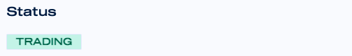
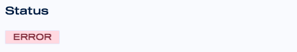

# DCA Bot Statuses

Mizar is constantly checking that your DCA bot is running in a healthy mode. If there is any issue, you will be informed on the performance page of the running bot.

If your status looks like the snapshot below, it means everything is running smoothly

If your status looks like the snapshot below, it means that some problem occurred.

Possible reasons:

**Insufficient funds**: If you are trading BTC/USDT, it means USDT is your quote asset. In order to be able to trade and to open positions, you need to have enough assets in your exchange. The bot is constantly checking that you have enough quote assets available in your exchange. If you do not have it, it will stop to trade until enough assets are available.


Solution: 

1\) Increase your available assets by depositing more capital into your exchange or swap some of your tokens. 

2\) Reduce your base or safety order size.


**Insufficient order size**: Exchanges have orders size limits. For example, the minimum order size of BTC/USDT in Binance is 10USDT. Limits can change based on exchanges, pairs or markets. In order to open positions, your bot is checking if the base or safety order size set your DCA bot settings exceed the minimum threshold set by the exchange. If the order size is below that threshold, the bot will not be able to open that order.


Solution:

1\) Edit your DCA Bot settings and increase your base or safety orders size to reach the minimum threshold set by the exchange.


**API authentication error**: The DCA bot you developed with Mizar automatically sends buy or sell signals to your exchange, based on the bot settings. Sometimes, there might be connectivity issues linked to different causes:

1. You did not enable Spot/Futures/Margin trading on your API settings.
2. The exchange API is corrupted or expired.


Solution:

1\) Review your API connectivity settings in your exchange.


1. **Permission denied**: Exchanges offer different services such as derivatives trading. Some of these functionalities have to be set into your exchange account. If you use some more advanced functionalities on Mizar \(such as FUTURES trading\) but you are not allowed to do that in your exchange, you might incur into the permission denied error. Some reasons:
   1. Your account is not allowed to trade Futures or derivatives.
   2. Your account is not allowed to trade certain pairs such as BULL or BEAR.


Solution:

1\) Review your exchange account settings.


For any kind of issue, the Mizar team is happy to assist you. For any inquire, contact us on [Telegram](https://t.me/mizar_ai) or [Discord](https://discord.gg/gM4mAYMeWG) or email us at info@mizar.ai.

