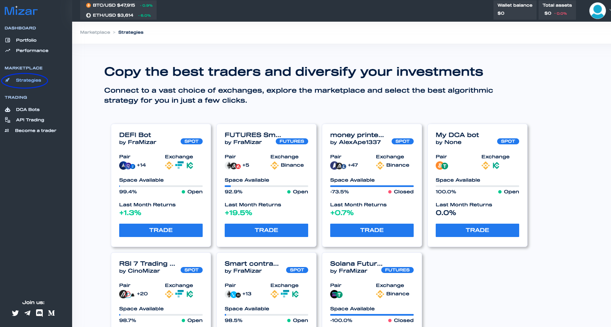

# Marketplace

Mizar offers the possibility for traders and investors to come together to invest in common trading strategies. This is achieved through the Mizar marketplace, a place where investors can search and compare trading strategies and allocate some capital to mirror the strategy performance.

Visit the marketplace and find your favourite strategy.


Check the performance, pairs traded, market and other usefull metrics.



Associate some capital and start to mirror strategies developed by other investors! You will be able to follow your performance and trades in the Performance section.

