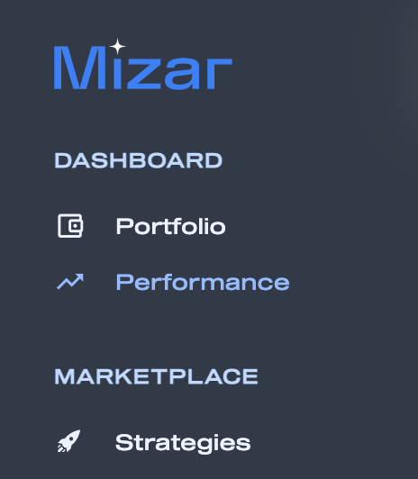
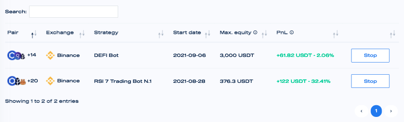
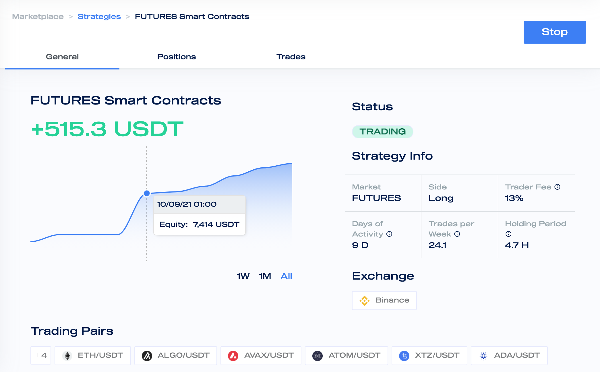

# Evaluate DCA Bot Performance

The DCA bot performances are visualised on the performance page accessible from the left sidebar.

The performance overview page shows a summary of the performance for each active bot and strategy.&#x20;

**Pair:** The pairs that the strategy can trade

**Exchange**: The exchange name the strategy is trading

**Strategy**: The name of the strategy

**Start date**: The date the strategy started to trade

**Max. Equity**: The maximum amount of assets that can be used by the strategy

**PnL**: Indicates the gross profits (i.e. before fees deductions) generated by the bot since its start.

A more in-depth evaluation of the bot is accessible when clicking on the bot name.

