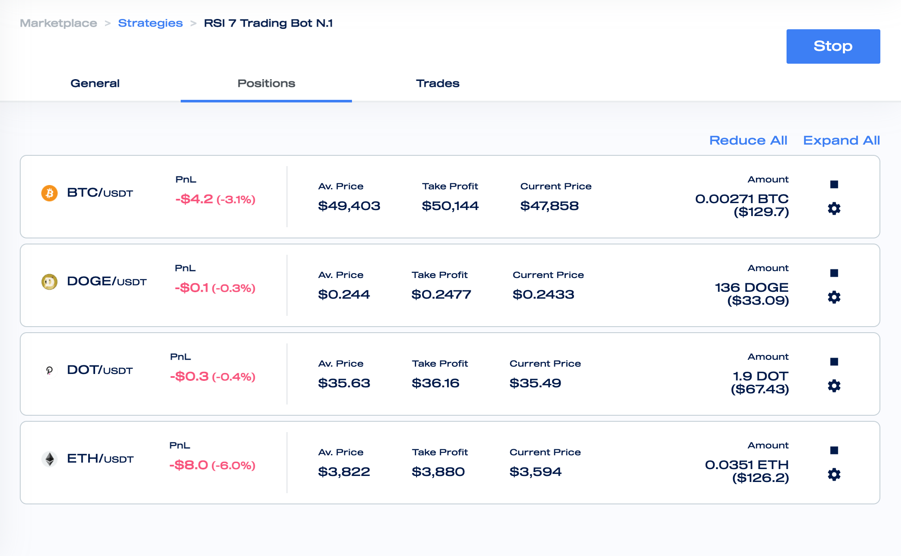
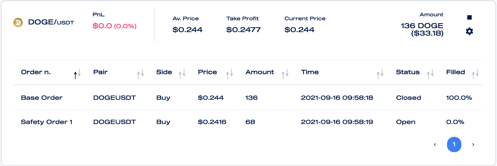

# Monitor and Manage Active Positions

Mizar allows to actively monitor, close, and edit active positions.

#### Monitoring

The positions are updated every second in order to inform traders whether they&#x20;

The position info can be expanded when clicking on it and more in-depth information of the position will be shown.

#### Closing

Close a position means to market sell/buy the assets that have been previously bought/sold by the bot for opening the position. You will need to click on the square in order to close manually the position.

#### Editing

You will be able to edit a position take profit by clicking on the edit button.
