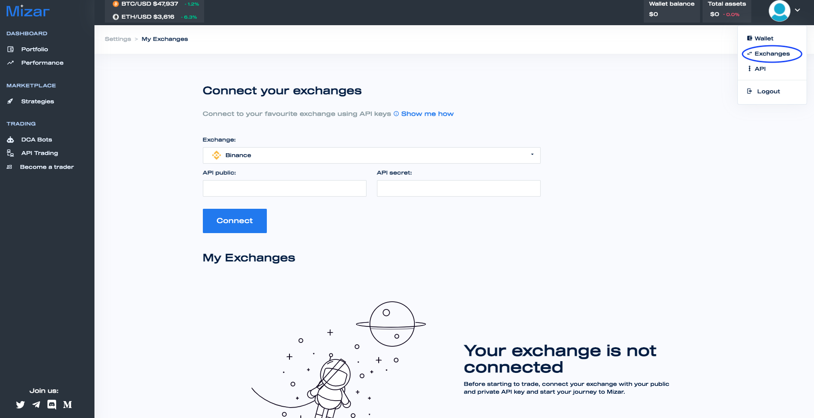
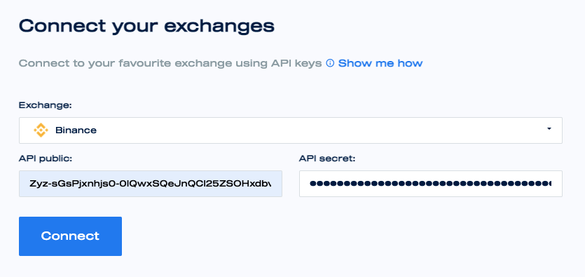

# Connect Your Exchange

Mizar is non-custodial, which means you will be able to invest in other investors' strategies while maintaining custody over your funds. Your capital is kept in your exchange or wallet and you will be the only person to have access to it. In order to access Mizar's services, you need to connect your exchange or wallet to the platform. Your account is protected by industry-leading security protocols and your APIs are encrypted. 

To connect to Mizar, follow these steps:


Go to the Exchange section.



Select your favourite exchange, insert your API keys and connect. 



Done! You are now connected to Mizar.


## Exchanges Available

| Exchange | SPOT Market | FUTURES Market | Links |
| :--- | :--- | :--- | :--- |
| Binance | ✓ | ✓ | [API](https://www.binance.com/en/support/faq/360002502072) |
| KuCoin | ✓ | COMING SOON | [API](https://support.kucoin.plus/hc/en-us/articles/360015102174-How-to-Create-an-API) |
| FTX | ✓ | COMING SOON | [API](https://help.ftx.com/hc/en-us/articles/360028807171-API-docs) |
| Okex | ✓ | COMING SOON | [API](https://www.okex.com/academy/en-in/how-to-use-api-trading-on-okex) |
| BitGet | ✓ | COMING SOON | [API](https://use.autoview.with.pink/hc/en-us/articles/360045950592-Bitget-Getting-Started) |
| BitFinex | COMING SOON | COMING SOON | COMING SOON |
| Coinbase | COMING SOON | COMING SOON | COMING SOON |
| Huobi | COMING SOON | COMING SOON | COMING SOON |

