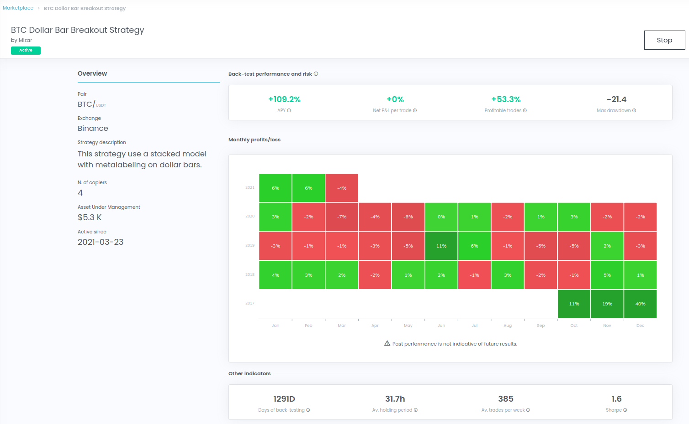

# Strategy Metrics

Investors can subscribe to algo-trading strategies on the marketplace and evaluate them based on the metrics from the backtest, which assesses how the strategy would have performed based on the history of the pair it is trading. 

There are multiple metrics to look at to help the investor make an informed decision on whether he or she wants to invest in the strategy \(see Figure 1\). This tutorial will explain what these metrics mean. 

* **APY \(Annual Percentage Yield\):** The APY shows much return the strategy would have made per year taking into account compounding effects. It is calculated as follows: 

$$
APY = (\frac{V_{T}}{V_{0}})^{\frac{365}{T}},
$$

where $$V_{T}$$is the total value at the end of the backtest at day $$T$$, and $$V_{0}$$is the starting value at the start of the backtest.

* **Net PnL per Trade:** The net profit and loss show how much profit is made per trade taking into account trading fees.
* **Profitable Trades:** The number of profitable trades as a percentage of the total number of trades made in the backtest.
* **Maximum Drawdown:** The maximum drawdown is the maximum observed loss from a historical peak of a strategy. Strategies with a low maximum drawdown are considered less risky.
* **No. of Copiers:** The number of investors that have currently subscribed to the strategy.
* **Assets Under Management:** The total amount of USD currently invested in the strategy.
* **Days of Backtesting:** The number of days of the backtesting period.
* **Average Holding Period:** The average holding period shows how long a position is open until it is closed on average.
* **Average Trades per Week:** The average number of trades made per week during the backtest.
* **Sharpe Ratio:** The Sharpe ratio adjusts the performance of the strategy for its risk. The Sharpe ratio is calculated with the daily returns and then annualized to a yearly Sharpe ratio to make it easier to compare. 

| Sharpe Ratio | Strategy Performance |
| :--- | :--- |
| &lt; 1.0 | Bad |
| 1.0 | Acceptable |
| 1.0 - 2.0 | Good |
| 2.0 - 3.0 | Very good |
| &gt; 3.0 | Excellent |

