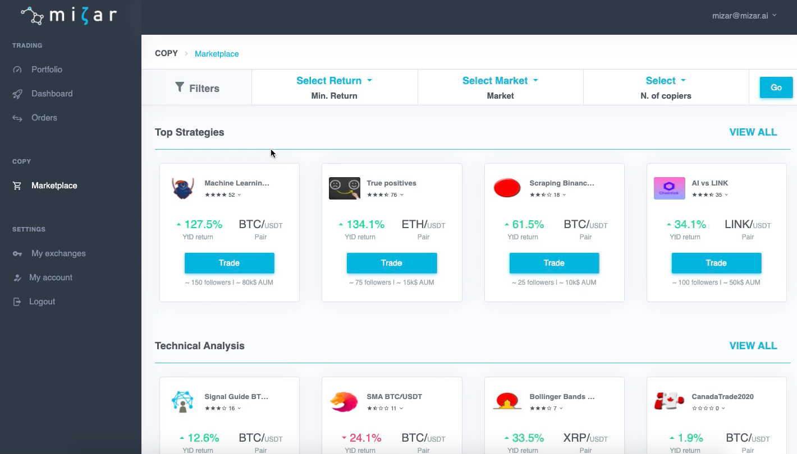
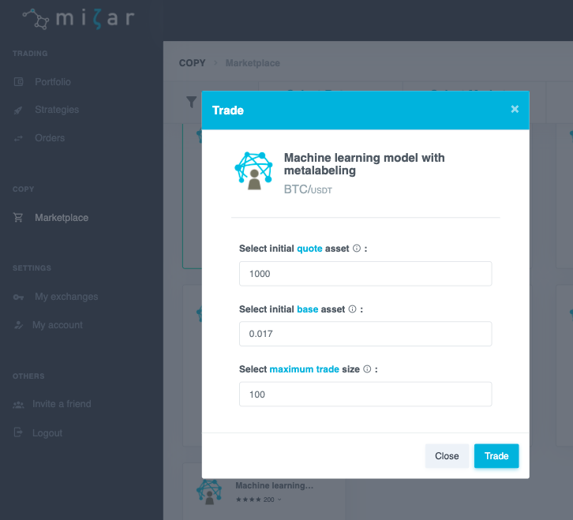

# Allocate Capital

Mizar offers the possibility for quants and investors to come together to invest in algorithmic trading strategies. This is achieved through Mizar's marketplace, a place where investors can search and compare algo-trading strategies and allocate some capital to mirror the strategies.

To allocate some capital, follow these steps:


Visit the marketplace and select your favourite strategy.



Associate some capital to the strategy. In order to do that, select an amount of quote and base asset and define the maximum trade size.



Trade.



Done! You are now mirroring an algo-trading strategy developed by another investor. You will be able to follow your performance and trades in the Strategies section.


