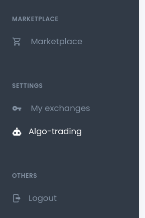

# How to create API key

Creating an API key allows you to access the bar data and publish strategies to Mizar.

#### Creating your own Mizar API

* After logging into Mizar, click Algo-trading situated on the Settings section of the sidebar. 

* Give a name to the API key and click create. 

* The API key will be shown at the bottom of the page
* Use the API key in your strategy development environment and remember to don't share your API key with anyone

