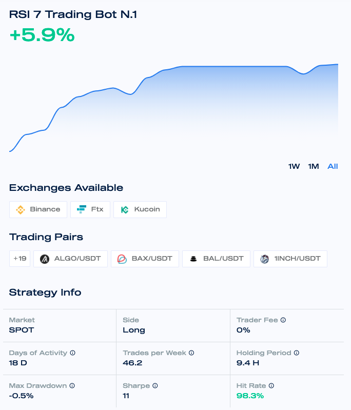

# Performance Metrics

There are multiple metrics to look at to help the investor make an informed decision on whether he or she wants to invest in the strategy \(see Figure 1\). This tutorial will explain what these metrics mean. 

* **Exchanges Available:** The exchanges where the strategy is able to trade.
* **Trading Pairs:** The pairs which the strategy is able to trade.
* **Market:** The market where the strategy is able to trade.
* **Side:** The side defines which kind of positions the strategy will open. If the strategy is LONG, it will open long \(buy\) positions only. If the strategy is SHORT, it will open short \(sell\) positions only. If the strategy is LONG/SHORT, it can open long or short positions.
* **Trader fee**: it is the performance fee which has to be paid to the trader at the end of the month. The Mizar fee \(10%\) is **NOT** included in this fee. That means the total fee will be the trader fee plus 10%. Check [Fee system](../fees/fee-system.md) for more info.
* **Returns:** The gross profit and loss \(i.e. before fees deductions\) shows the amount of gross profits or loss that has been performed from the strategy since its start.
* **Days of Activities:** The number of days since the strategy is actively trading.
* **Trades per Week:** The average number of trades made per week.
* **Holding Period:** The average holding period shows how long a position is open until it is closed, on average.
* **Maximum Drawdown:** It is the maximum observed loss from a historical peak of a strategy. Strategies with a low maximum drawdown are considered less risky.
* **Sharpe Ratio:** The Sharpe ratio adjusts the performance of the strategy for its risk. The Sharpe ratio is calculated with the daily returns and then annualized to a yearly Sharpe ratio to make it easier to compare. See info below for more details.
* **Hit Rate:** The number of profitable trades as a percentage of the total number of trades performed from the strategy since its start.

| Sharpe Ratio | Strategy Performance |
| :--- | :--- |
| &lt; 1.0 | Bad |
| 1.0 | Acceptable |
| 1.0 - 2.0 | Good |
| 2.0 - 3.0 | Very good |
| &gt; 3.0 | Excellent |

