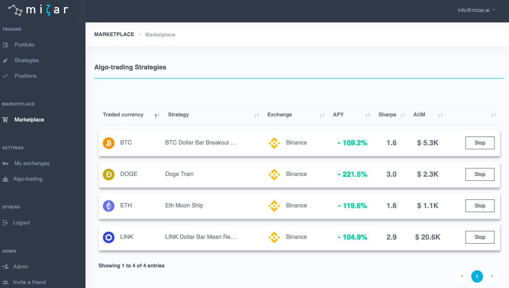

# Marketplace

Mizar offers on its platform a marketplace where quants and investors can come together to invest in algorithmic trading strategies. Quants will be able to publish their trading strategy and share them with other investors in order to get rewarded base on performance. Quants will have to authenticate themselves to be allowed to publish strategies.

Investors can search for trading strategies published by quants and decide whether they wish to invest their capital into the strategy pool. Investors will be able to compare multiple strategies with each other based on back-tested or live performance, quant's reputation, and performance fees. 

