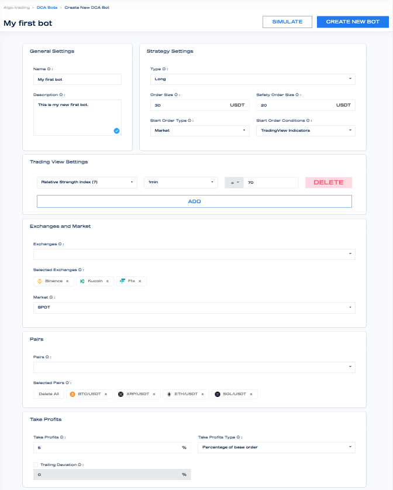

# BotLabs

Mizar offers to traders of all level professional trading tools to put their cryptos in motion and automate their trades. 

Traders can develop simple or advanced bots, trading multiple pairs on multiple exchanges at the same time, on SPOT or FUTURES markets. The Mizar team developed a low-latency, safe and secure infrastructure to let traders focus on their main needs: trade, maximizing profits, and minimizing risks. 

Trading cryptos is hard and with far greater risk than other markets. Crypto trading is 24/7, time-consuming and requires advanced tech and financial know-how. With Mizar you can develop your own bot, overcome emotions and get advantage from crypto in any market conditions.

With BotLabs, you do not have to be an expert trader or quant. Mizar developed a user-friendly interface where everyone can develop bots simply by a couple of clicks of a mouse.

What are you waiting for? Sign-up on Mizar and start to trade!

