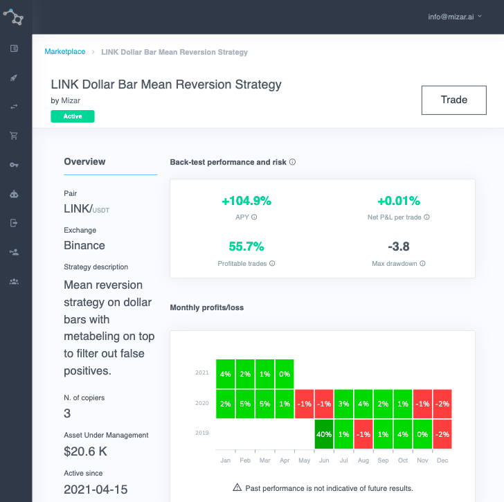

# Strategy Performance Analytics

Mizar platform provides to investors and quants pleasant and smart analytical tools. Users will be able to track the back-tested or live performance of the strategies available on the marketplace. 

Investors will be also able to track their own performance in a transparent and simple way, looking at open and closed positions, monthly returns, and many other indicators.

Moreover, investors will be able to track their portfolio balance and monitor more exchanges/wallets from one single platform.

