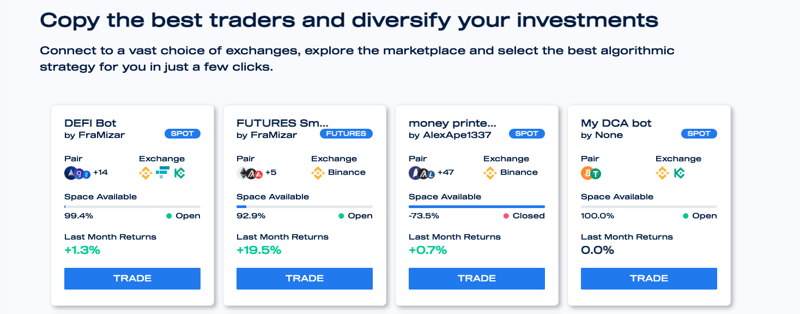
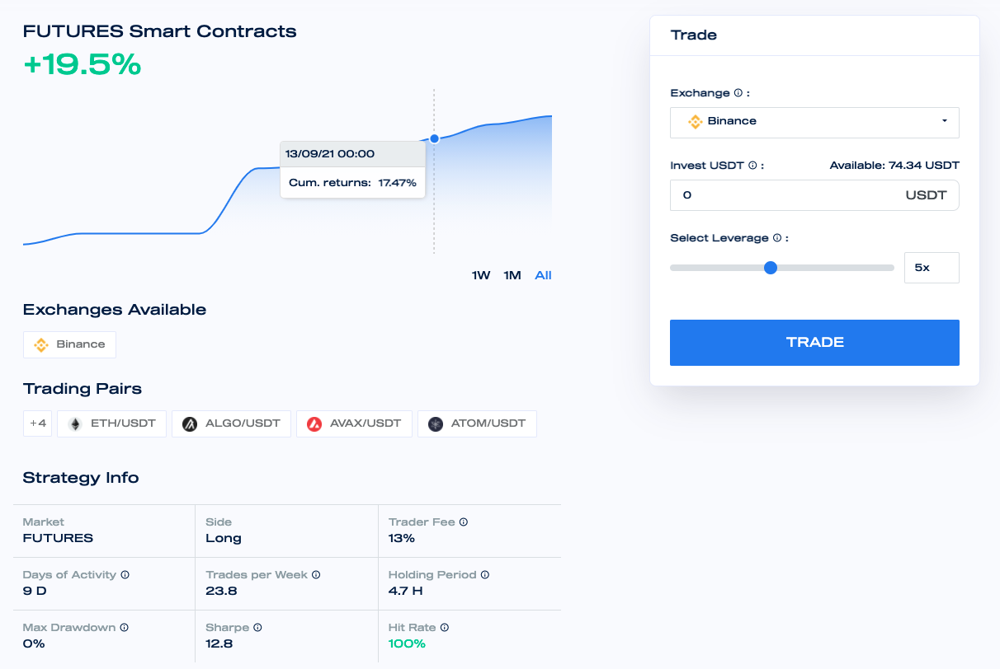

# Marketplace

**Mizar offers a marketplace where traders and investors can come together to invest in the best performing trading strategies to increase the size of their portfolios.**&#x20;

Traders can publish their trading strategies and rank them alongside other investors in order to earn passive income based on their monthly realized performance, while Investors can search for trading strategies published by traders based on a variety of metrics and invest in the ones that fit their performance & risk profiles. Investors will be able to compare multiple strategies with each other based on live performance, trader's reputation, trader fee, as well as other key performance indicators that will all be compiled neatly into one place.

