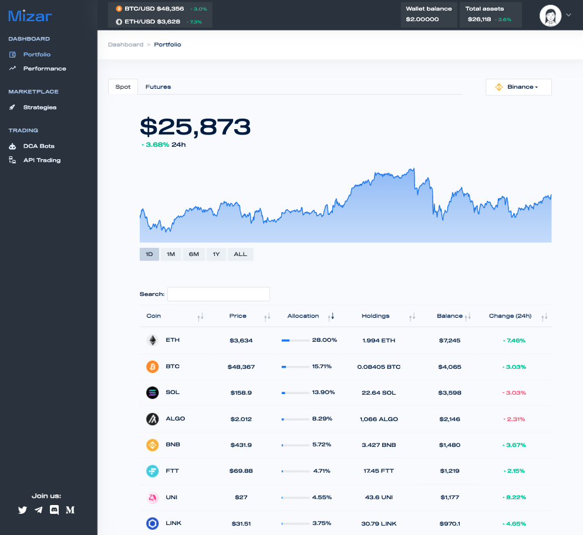

# TradingLabs

Mizar is simplifying trading with TradingLabs. Traders of all levels can optimize their manual trading activities by doing it from one single place, on multiple exchanges and markets. Moreover, traders can get support from automation by setting predefined rules such as take profits or stop losses, to close a position whenever the target price is reached. This, along with our BotLabs bots, provides unparalleled automation of trading. All supported exchanges, all in one place, which means users can analyze their portfolio or execute trades without ever having to change a tab.

