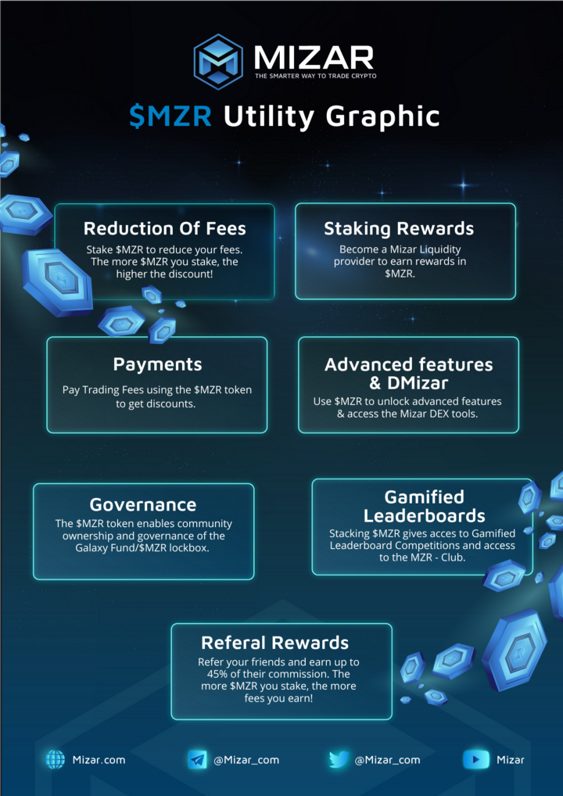

# MZR Token

The $MZR token sits at the heart of the Mizar platform, aligning incentives between user groups, increasing engagement, and rewarding positive behaviors. A native utility token, the primary role of $MZR is to facilitate reduced fees, allowing users to maximize their trading profits.

<figure><figcaption></figcaption></figure>
